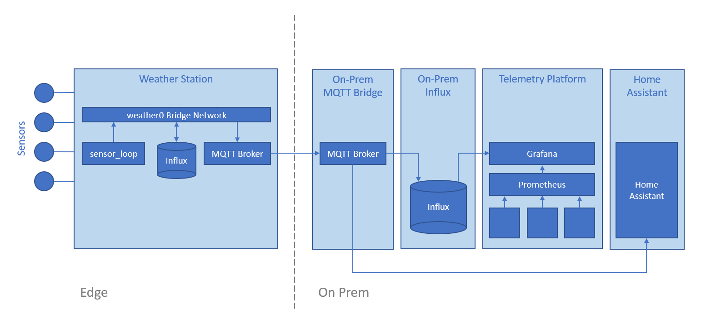

# Weather Station

## Architecture



## Hardware Platform

- Raspberry Pi 3B
- X702 UPS Board with two 18650 cells (TODO which brand)
- Transcend 128GB SSD

## Operating System Configuration

### Install Raspbian OS Lite 32-bit

Install, then update/ugprade

```bash
sudo apt update
sudo apt upgrade -y
```

References:

- [https://www.raspberrypi.org/forums/viewtopic.php?t=275370](https://www.raspberrypi.org/forums/viewtopic.php?t=275370)

### Check Distro for Later Reference

```bash
$ lsb_release -d
Description:    Raspbian GNU/Linux 10 (buster)
```

### Enable SSD Boot

This is a one-off change - now that it has been done, this Raspberry Pi is permanently configured to allow SSD boot.

### Enable I2C

Edit `/boot/config.txt` and uncomment the line to enable I2C:

```
# Uncomment some or all of these to enable the optional hardware interfaces
dtparam=i2c_arm=on
```

References:

- [STICKY:I2C, SPI, I2S, LIRC, PPS, stopped working?](https://www.raspberrypi.org/forums/viewtopic.php?f=28&t=97314)

### Docker

Install Docker using the [convenience script](https://docs.docker.com/engine/install/debian/#install-using-the-convenience-script) from the Docker site:

```bash
sudo apt-get remove docker docker-engine docker.io containerd runc
curl -fsSL https://get.docker.com -o get-docker.sh
sudo sh get-docker.sh
```

Install docker-compose:

```bash
# Dependencies
sudo apt-get install -y libffi-dev libssl-dev
sudo apt install -y python3-dev
sudo apt-get install -y python3 python3-pip

# docker-compose
sudo pip3 install docker-compose
```

References:

- https://devdojo.com/bobbyiliev/how-to-install-docker-and-docker-compose-on-raspberry-pi

### Prometheus Exporters

See `als_sys_container_telemetry` for details of how to set these up.

Exporters installed:

- rpi_exporter
- node_exporter
- Docker Engine
- cAdvisor (TODO: note arm7 version not yet available)

## Foundational Tools

### git

```bash
sudo apt install -y git
```

### I2C Utilities

```bash
sudo apt install -y i2c-tools
```

### tmux

```bash
sudo apt install -y tmux
```

### MQTT / Mosquitto Tools

Note we need to install the `mosquitto` package even though we don't need the Mosquitto server on the host itself (since we run in Docker) but this package is also where `mosquitto_passwd` comes from.

```bash
wget http://repo.mosquitto.org/debian/mosquitto-repo.gpg.key
sudo apt-key add mosquitto-repo.gpg.key
rm mosquitto-repo.gpg.key

cd /etc/apt/sources.list.d/

# Ensure this is the matching distro
sudo wget http://repo.mosquitto.org/debian/mosquitto-buster.list

sudo apt-get update
sudo apt-get install -y \
	mosquitto \
	mosquitto-clients
```

Disable the service so that we're not wasting resources, and so we can later bind the port to the Docker container:

```bash
sudo systemctl stop mosquitto
sudo systemctl disable mosquitto
```

## Clone Weather Station Repository

Clone the repo from GitHub:

```bash
https://github.com/brendonmatheson/weather-station.git
```

## MQTT Local Broker

### Introduction

The weather station runs an MQTT broker locally so that a local InfluxDB can capture measurements at the same time as those messages are forwarded via a bridge to a central MQTT broker for on-prem and on-cloud persistence.

The `broker` component provides a Docker Compose configuration for running the local broker.

The MQTT broker is running on the official [eclipse-mosquitto](https://hub.docker.com/_/eclipse-mosquitto) Docker image, and the version is pinned and should be updated regularly.

### Running the Local Broker

Start the broker using the provided convenience script:

```bash
./start.sh
```

Stop the broker using the provided convenience script:

```bash
./stop.sh
```

### Configuration

Configuration for the local broker is under `config/` in the `broker` component.

| Setting              | Value                             | Notes                                                        |
| -------------------- | --------------------------------- | ------------------------------------------------------------ |
| listener             | 1883 0.0.0.0                      | This is set explicitly because by default Moquitto will bind only to loopback.  See this [StackOverflow thread](https://github.com/eclipse/mosquitto/issues/2040) for explanation. |
| log_dest             | file /mosquitto/log/mosquitto.log | Location for the log which is in-turn mapped to a volume in docker-compose.yaml. |
| persistence          | true                              | Enables persistence.                                         |
| persistence_location | /mosquitto/data/                  | Location for persistence which is in-turn mapped to a volume in docker-compose.yaml. |
| password_file        | /mosquitto/config/users           | Location for users which is in-turn mapped from the file in the `broker` component files. |

References:

- https://mosquitto.org/man/mosquitto-conf-5.html

### Authentication

Users are stored in config/users

Use the `mosquitto_passwd` command to add or alter users.  See Appendix A for more details.

### Testing

To test the local broker, open two shells and in the first one subscribe to a "test" topic:

```bash
mosquitto_sub -t "test" -u "hea92weather01" -P "password"
```

Then in the other shell publish a message to that "test" topic:

```bash
mosquitto_pub -t "test" -m "message" -p 1883 -u "hea92weather01" -P "password"
```

If the broker is configured correctly and working, then you will see "message" echoed in the subscriber's shell.

References:

- [mosquitto_pub](https://mosquitto.org/man/mosquitto_pub-1.html)
- [mosquitto_sub](https://mosquitto.org/man/mosquitto_sub-1.html)

### Design

The MQTT processing loop is based on explanation and code samples from [Steve's Internet Guide](http://www.steves-internet-guide.com/) (see the references below).

Removing the sensor reader code, the MQTT skeleton looks like this:

```python
class SensorReader:

	def __init__(self):
		self.stopped = False

	def run(self):

		broker = "broker_mosquitto_1"
		port = 1883
		client_id = "hea92weather01"
		username = "hea92weather01"
		password = "password"

		def mqtt_on_connect(client, userdata, flags, rc):
			if rc == 0:
				print("Connected to MQTT broker")
				client.connected_flag = True
			else:
				print("Failed to connect")

		def mqtt_on_disconnect(client, userdata, rc):
			print("Disconnecting reason " + str(rc))
			client.connected_flag = False
			client.disconnect_flag = True

		client = mqtt.Client(client_id)
		client.on_connect = mqtt_on_connect
		client.on_disconnect = mqtt_on_disconnect
		client.connected_flag = False
		client.username_pw_set(username, password)
		client.connect(broker, port)
		client.loop_start()

		while not self.stopped and not client.connected_flag:
			print("Waiting for connection")
			sleep(1)

		while not self.stopped:

			if (client.connected_flag):

				# Get and publish sensor readings
                
				sleep(1)

			else:
				print("Connection lost.  Waiting for reconnection")
				sleep(5)

		client.loop_stop()
		client.disconnect()

	def stop(self, signal, frame):
		print("Stopping SensorReader")
		self.stopped = True

def main():
	sensorReader = SensorReader()
	signal.signal(signal.SIGINT, sensorReader.stop)
	signal.signal(signal.SIGTERM, sensorReader.stop)
	sensorReader.run()

if __name__ == "__main__":
	main()
```

References:

- [Python MQTT Client Connections– Working with Connections](http://www.steves-internet-guide.com/client-connections-python-mqtt/)
- [Paho Python MQTT Client – Understanding Callbacks](http://www.steves-internet-guide.com/mqtt-python-callbacks/)
- [Paho Python MQTT Client-Understanding The Loop](http://www.steves-internet-guide.com/loop-python-mqtt-client/)

## InfluxDB Local Storage

### Introduction

The weather station stores data locally in addition to that data being shipped out via MQTT for external processing and storage.

The `storage` component provides a Docker Compose configuration for running InfluxDB 1.8 for storage and Telegraf for data-shipping.  Note that we are using 1.8 for the local storage because it is the latest version for which an official image supporting arm7 architecture is maintained by Influx.

References:

- [InfluxDB Docker Image](https://hub.docker.com/_/influxdb)
- [InfluxDB 1.8 Documentation](https://docs.influxdata.com/influxdb/v1.8/)
- [Telegraf Docker Image](https://hub.docker.com/_/telegraf)
- [Explore data using InfluxQL](https://docs.influxdata.com/influxdb/v1.8/query_language/explore-data/)

### Running the Local Storage

Start the database using the provided convenience script:

```bash
./start.sh
```

Stop the database using the provided convenience script:

```bash
./stop.sh
```

### First Run User Confguration

If this is the first time that the stack has been run on a node, or if the data volume was dropped, then users need to be created.

- First disable authentication by setting `auth-enabled = false` in confg/influxb.conf
- Launch the stack with `./start.sh`
- Open an Influx shell with `./influx.sh`
- Create the `weather` database:

```
CREATE DATABASE "weather"

# Select the database - required for the following CREATE USER steps
USE weather
```

- Create the required users:

```
# admin user - used by the influx.sh shell script
CREATE USER admin WITH PASSWORD 'password' WITH ALL PRIVILEGES

# telegraf - used by Telegraf for writing data to InfluxDB
CREATE USER telegraf WITH PASSWORD 'password'
GRANT ALL ON weather to telegraf

# grafana - used by Grafana dashboards for reading data
CREATE USER grafana WITH PASSWORD 'password'
GRANT READ ON weather to grafana
```

References:

- [InfluxDB 1.x Authentication](https://docs.influxdata.com/influxdb/v1.8/administration/authentication_and_authorization/)
- [InfluxDB 1.x User Setup](https://docs.influxdata.com/influxdb/v1.8/administration/authentication_and_authorization/#user-management-commands)

### Telgraf Debugging

To debug Telgraf you can:

- Enable debug-level logging by uncommenting  the `debug=true` line in config/telegraf.conf
- Send messages to file (as well as influx) by uncommenting the `outputs.file` block

## Sensor Reader

### Running Directly

To run the reader directly on the host, first install required libraries:

```bash
pip3 install \
    RPi.bme280 \
    paho-mqtt \
    SI1145
```

Then launch the process:

```bash
python3 main.py
```

### Running in Docker

sensor-reader is intended to normally be run as a Docker container.

Use the provided convenience script to build the Docker image:

```bash
./build.sh
```

To test, use the provided convenience script:

```bash
./run.sh
```

### Design

The `sensor` component collects measurements from it's attached sensors every second, formats those measurements into an Influx line protocol messages, and sends the message to the local broker.

Note that the configuration of the `mqtt` input plugin on Telegraf in the `storage` component is set to expect influx line format messages.


Note that the configuration of the `mqtt` input plugin on Telegraf in the local-influx component is set to expect influx line format messages.

References:

- [InfluxDB Line Protocol](https://docs.influxdata.com/influxdb/v1.8/write_protocols/line_protocol_tutorial/)

### Testing

```bash
mosquitto_sub -t "hea92weather01/humidity" -u "hea92weather01" -P "password"
mosquitto_sub -t "hea92weather01/pressure" -u "hea92weather01" -P "password"
mosquitto_sub -t "hea92weather01/temperature" -u "hea92weather01" -P "password"
```

References:

- [mosquitto_pub](https://mosquitto.org/man/mosquitto_pub-1.html)
- [mosquitto_sub](https://mosquitto.org/man/mosquitto_sub-1.html)

### BME280 Temperature / Humidity / Pressure Sensor

References:

- [Raspberry Pi Weather Station - BME280](https://projects.raspberrypi.org/en/projects/build-your-own-weather-station/2)

### GY1145 Light Sensor

The weather station has a GY1145 sensor and uses the SI1145 Python library by Joe Gutting on GitHub.

- [SI1145 library on PyPI](https://pypi.org/project/SI1145/)
- [SI1145 library on GitHub](https://github.com/THP-JOE/Python_SI1145)

References:

- [Raspberry Pi and Si1145 sensor example](http://www.pibits.net/code/raspberry-pi-and-si1145-sensor-example.php)

## Appendix A - Useful Commands

### i2cdetect

This is from the `i2c-tools` package, and will probe the bus for I2C devices.  For example the following verifies that there is a device at address 0x76 which is our BME280 sensor:

```bash
$ i2cdetect -y 1

     0  1  2  3  4  5  6  7  8  9  a  b  c  d  e  f
00:          -- -- -- -- -- -- -- -- -- -- -- -- --
10: -- -- -- -- -- -- -- -- -- -- -- -- -- -- -- --
20: -- -- -- -- -- -- -- -- -- -- -- -- -- -- -- --
30: -- -- -- -- -- -- -- -- -- -- -- -- -- -- -- --
40: -- -- -- -- -- -- -- -- -- -- -- -- -- -- -- --
50: -- -- -- -- -- -- -- -- -- -- -- -- -- -- -- --
60: -- -- -- -- -- -- -- -- -- -- -- -- -- -- -- --
70: -- -- -- -- -- -- 76 --
```

### mosquitto_passwd

Used to generate a password database file for the Mosquitto server process.

To add / update a user:

```
mosquitto_passwd config/users hea92weather01
```

References:

- [mosquitto_passwd](https://mosquitto.org/man/mosquitto_passwd-1.html)

## Appendix B - Technical References

### Raspberry Pi GPIO Header


## Appendix C - Troubleshooting

### AttributeError: module 'bme280' has no attribute 'load_calibration_params'

Once I got the I2C bus working, I next got the following Python error:

```bash
AttributeError: module 'bme280' has no attribute 'load_calibration_params'
```

The root cause was that I had named my script `bme280.py` and so the `import bme280` was resolving to my script rather than the actual BME280 library.  After renaming my script to `sensor_loop.py` the import was resolved correctly.

## Appendix D - Third-Party Weather Station Products

### Gaia Air Quality Monitor

http://aqicn.org/gaia/

## Appendix E - Sensors

### SDS011 Air Quality Sensor

- [AliExpress Listings](https://www.aliexpress.com/wholesale?catId=0&initiative_id=SB_20210316183809&SearchText=sds011)
- [ESPHome Support](https://esphome.io/components/sensor/sds011.html)

### PMS3003 Air Quality Sensor

TODO

### PMS5003 Air Quality Sensor

TODO

- [ESPHome Support](https://esphome.io/components/sensor/pmsx003.html)

### PMS7003 Air Quality Sensor

TODO

### ZH03B Air Quality Sensor

TODO

### PMSA0003 Air Quality Sensor

TODO

### MH-Z19 MH-Z19B NDIR CO2 Sensor Module 

TODO


